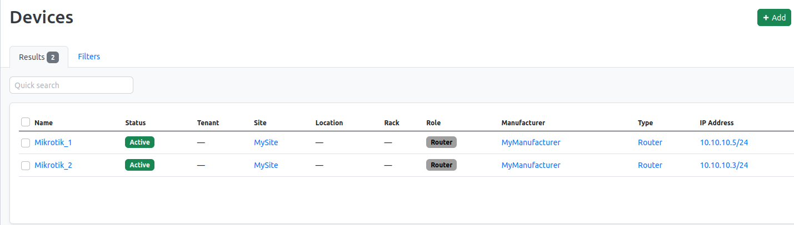
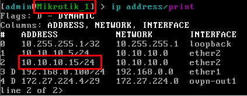
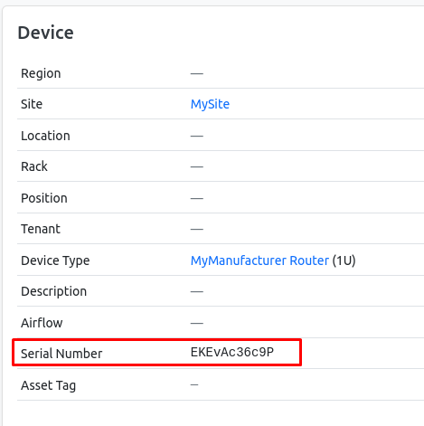

University: [ITMO University](https://itmo.ru/ru/)

Faculty: [FICT](https://fict.itmo.ru)

Course: [Network programming](https://github.com/itmo-ict-faculty/network-programming)

Year: 2022/2023

Group: K34212

Author: Gavrilushkin Alexandr Alekseevich

Lab: Lab3

Date of create: 15.12.2022

Date of finished: 20.12.2022

## Установка Netbox

### Настройка окружения

1. Устанавливаем PostgreSQL:
```
sudo apt-get install -y postgresql libpq-dev
```
2. Подключаемся к PostgreSQL:
```
sudo -u postgres psql
```
3. Создаём БД и суперпользователя:
```
postgres=# CREATE DATABASE netbox;
postgres=# CREATE USER admin WITH PASSWORD 'admin';
postgres=# GRANT ALL PRIVILEGES ON DATABASE netbox TO admin;
```
4. Устанавливаем Redis:
```
sudo apt-get install -y redis-server
```
5. Устанавливаем python-пакеты:
```
sudo apt-get install -y python3 python3-pip python3-venv python3-dev build-essential libxml2-dev libxslt1-dev libffi-dev libpq-dev libssl-dev zlib1g-dev
```

### Установка Netbox

1. Скачиваем архив с netbox:
```
wget https://github.com/netbox-community/netbox/archive/v3.4.1.tar.gz
tar -xzf v3.4.1.tar.gz -C /opt
```
2. Добавляем пользователя:
```
groupadd --system netbox
adduser --system --gid 996 netbox
chown --recursive netbox /opt/netbox/netbox/media/
```
3. Создаём окружение:
```
python3 -m venv /opt/netbox/venv
source venv/bin/activate
pip3 install -r requirements.txt
```

### Настройка Netbox

1. Копируем конфигурационный файл:
```
cp configuration.example.py configuration.py
```
2. В ALLOWED_HOSTS добавляем 127.0.0.1, в DATABASE логин и пароль, SECRET_KEY генерируем самостоятельно:
```
python3 netbox/generate_secret_key.py
```
3. Запускаем миграции с БД:
```
source venv/bin/activate
python3 manage.py migrate
```
4. Создаём суперпользователя.
```
python3 manage.py createsuperuser
```
5. Собираем статику:
```
python3 manage.py collectstatic --no-input
```

### Установка Nginx

```
sudo apt-get install -y nginx
sudo cp /opt/netbox/contrib/nginx.conf /etc/nginx/sites-available/netbox
cd /etc/nginx/sites-enabled/
sudo rm default
sudo ln -s /etc/nginx/sites-available/netbox
sudo nginx -t
sudo nginx -s reload
sudo cp contrib/gunicorn.py /opt/netbox/gunicorn.py
sudo cp contrib/*.service /etc/systemd/system/
sudo systemctl daemon-reload
sudo systemctl start netbox netbox-rq
sudo systemctl enable netbox netbox-rq
```

### Запуск сервера

```
python3 manage.py runserver 0.0.0.0:8000 --insecure
```

## Информация о роутерах

Создаём сайт, мануфактуру и роль. Создаём 2 роутера. Создаём для этих роутеров интерфейс ether2. Назначаем ему первичный IP, равный IP роутеров в сети и произвольный вторичный адрес. Итог:



## Устанавливка ansible-модулей для Netbox'a

```
ansible-galaxy collection install netbox.netbox
```

## Сбор данных из Netbox

1. Создаём файл netbox_inventory.yml:
```
plugin: netbox.netbox.nb_inventory
api_endpoint: http://127.0.0.1:8000
token: 4a6081059b705c5bd93fb1f1c40e9dd904d83f56
validate_certs: True
config_context: False
interfaces: True
```
2. Сохраняем вывод скрипта в файл командой:
```
ansible-inventory -v --list -y -i netbox_inventory.yml > nb_inventory.yml
```
3. В файле теперь находится информация об устройствах в YAML-формате. Мы можем использовать данный файл в качестве инвентарного.

## Настройка роутеров по информации из Netbox

1. Перенесём в новый inventory-файл старые переменные для подключения к роутерам:
```
ansible_connection: ansible.netcommon.network_cli
ansible_network_os: community.routeros.routeros
ansible_ssh_user: admin
ansible_ssh_pass: "111"
ansible_ssh_port: 22
```
[Итоговый файл](nb_inventory.yml)

2. Playbook для изменения имени устройства и добавления IP:
```
- name: Setup Routers
  hosts: ungrouped
  tasks:
    - name: Set Device Name
      community.routeros.command:
        commands:
          - /system identity set name="{{interfaces[0].device.name}}"
    - name: Set IP
      community.routeros.command:
        commands:
        - /ip address add address="{{interfaces[0].ip_addresses[1].address}}" interface="{{interfaces[0].display}}"
```

## Экспорт данных с роутера в Netbox

```
- name: Get Serial Numbers
  hosts: ungrouped
  tasks:
    - name: Get Serial Number
      community.routeros.command:
        commands:
          - /system license print
      register: license_print
    - name: Get Name
      community.routeros.command:
        commands:
          - /system identity print
      register: identity_print
    - name: Add Serial Number to Netbox
      netbox_device:
        netbox_url: http://127.0.0.1:8000
        netbox_token: 4a6081059b705c5bd93fb1f1c40e9dd904d83f56
        data:
          name: "{{identity_print.stdout_lines[0][0].split(' ').1}}"
          serial: "{{license_print.stdout_lines[0][0].split(' ').1}}"
```

## Результаты





## Вывод
В процессе выполнения лабораторной работы я получил базовые навыки работы со связкой Ansible-Netbox: настроил роутеры по информации из Netbox/настроил устройства в каталоге Netbox'a по информации от реальных(виртуальных) устройств.
