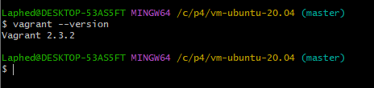
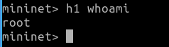

University: [ITMO University](https://itmo.ru/ru/)

Faculty: [FICT](https://fict.itmo.ru)

Course: [Network programming](https://github.com/itmo-ict-faculty/network-programming)

Year: 2022/2023

Group: K34212

Author: Gavrilushkin Alexandr Alekseevich

Lab: Lab4

Date of create: 23.12.2022

Date of finished: 

# Базовая 'коммутация' и туннелирование, используя язык программирования P4

## Настройка окружения

1. Клонируем репозиторий [p4lang/tutorials](https://github.com/p4lang/tutorials)
2. Открываем консоль в папке vm-ubuntu-20.04. Проверяем, установлен ли Vagrant:



3. Поднимаем машину командой:

```
vagrant up
```

4. Заходим в созданную виртуальную машину под учетной записью p4/p4. Переходим в каталог tutorials/exercices/basic. Поднимаем виртуальную сеть Mininet и компилируем basic.p4 командой (makefile уже есть в папке):

```
make run
```

5. Должна была подняться такая виртуальная сеть:


7. Проверяем, что всё работает, узнав имя пользователя h1:



## Basic Forwarding

В данном упражнении нужно дополнить скрипт basic.p4 так, чтобы в сети заработала переадресация IP-пакетов.
Алгоритм переадресации (свич):
1. Получает пакет;
2. Парсит пакет и получает целевой IP-адрес;
3. Сопоставляет IP с таблицей маршрутизации;
4. Если адреса нет, дропает пакет;
5. Если адрес есть, меняет ethernet-порт и целевой ethernet-адрес на соответствующие следующему узлу, а ethernet-адрес источника заменяет на свой;
6. Понижает TTL;
7. Запаковывает новые данные;
8. Отправляет пакет дальше.

Все нужные структуры данных (заголовки) созданы заранее. Нужно только написать логику парсера/депарсера, проверки таблицы и изменения пакета.

1. Как реализуется парсинг можно подсмотреть в подсказке, лежащей в репозитории:


Любой парсинг в P4 начинается с состояния start, а заканчивается состоянием accept, между которыми происходит основная логика, select - местный аналог switch-case. По заданию нам нужно самим написать операцию парсинга в ipv4. У типа packet_in есть заранее готовая функция extract, распаковывающая пакет, поэтому задача сводится лишь к обертке этой функции в стейт parse_ipv4. Итоговый код парсера:

```
parser MyParser(packet_in packet,
                out headers hdr,
                inout metadata meta,
                inout standard_metadata_t standard_metadata) {

    state start { transition parse; }
    
    state parse{
      packet.extract(hdr.ethernet);
      transition select(hdr.ethernet.etherType){
        TYPE_IPV4: parse_ipv4;
        default: accept;
        }
    }
      
    state parse_ipv4{
      packet.extract(hdr.ipv4);
      transition accept;
    }
}
```

2. Изменяем входящий пакет в action'e ipv4_forward:

```
action ipv4_forward(macAddr_t dstAddr, egressSpec_t port) {
        standard_metadata.egress_spec= port; // Изменяем порт
        hdr.ethernet.srcAddr = hdr.ethernet.dstAddr; // Меняем адрес источника на свой
        hdr.ethernet.dstAddr = dstAddr; // Устанавливаем нового получателя
        hdr.ipv4.ttl = hdr.ipv4.ttl - 1; // Декрементируем TTL
}
```

3. Основной код для работы с таблицей уже прописан. Допишем недостающий условный оператор:

```
    table ipv4_lpm {
        key = {
            hdr.ipv4.dstAddr: lpm; // ключ таблицы
        }
        actions = {       // возможные действия
            ipv4_forward; 
            drop;
            NoAction;
        }
        size = 1024;    // размер таблицы
        default_action = NoAction(); // действие по умолчанию
    }

    apply {
        if(hdr.ipv4.isValid()){ // Недостающая часть (проверка)
          ipv4_lpm.apply();
        }
    }
```

4. Логика депарсера самая простая. У пакета есть функция emit, отвечающая за добавление заголовков.

```
control MyDeparser(packet_out packet, in headers hdr) {
    apply {
        packet.emit(hdr.ethernet);
        packet.emit(hdr.ipv4);
    }
}
```

5. Итоговый файл выглядит так:

```
/* -*- P4_16 -*- */
#include <core.p4>
#include <v1model.p4>

const bit<16> TYPE_IPV4 = 0x800;

/*************************************************************************
*********************** H E A D E R S  ***********************************
*************************************************************************/

typedef bit<9>  egressSpec_t;
typedef bit<48> macAddr_t;
typedef bit<32> ip4Addr_t;

header ethernet_t {
    macAddr_t dstAddr;
    macAddr_t srcAddr;
    bit<16>   etherType;
}

header ipv4_t {
    bit<4>    version;
    bit<4>    ihl;
    bit<8>    diffserv;
    bit<16>   totalLen;
    bit<16>   identification;
    bit<3>    flags;
    bit<13>   fragOffset;
    bit<8>    ttl;
    bit<8>    protocol;
    bit<16>   hdrChecksum;
    ip4Addr_t srcAddr;
    ip4Addr_t dstAddr;
}

struct metadata {
    /* empty */
}

struct headers {
    ethernet_t   ethernet;
    ipv4_t       ipv4;
}

/*************************************************************************
*********************** P A R S E R  ***********************************
*************************************************************************/

parser MyParser(packet_in packet,
                out headers hdr,
                inout metadata meta,
                inout standard_metadata_t standard_metadata) {

    state start { transition parse; }

    state parse{
      packet.extract(hdr.ethernet);
      transition select(hdr.ethernet.etherType){
        TYPE_IPV4: parse_ipv4;
        default: accept;
        }
    }

    state parse_ipv4{
      packet.extract(hdr.ipv4);
      transition accept;
    }
}


/*************************************************************************
************   C H E C K S U M    V E R I F I C A T I O N   *************
*************************************************************************/

control MyVerifyChecksum(inout headers hdr, inout metadata meta) {
    apply {  }
}


/*************************************************************************
**************  I N G R E S S   P R O C E S S I N G   *******************
*************************************************************************/

control MyIngress(inout headers hdr,
                  inout metadata meta,
                  inout standard_metadata_t standard_metadata) {
    action drop() {
        mark_to_drop(standard_metadata);
    }

    action ipv4_forward(macAddr_t dstAddr, egressSpec_t port) {
        standard_metadata.egress_spec= port;
        hdr.ethernet.srcAddr = hdr.ethernet.dstAddr;
        hdr.ethernet.dstAddr = dstAddr;
        hdr.ipv4.ttl = hdr.ipv4.ttl - 1;
    }

    table ipv4_lpm {
        key = {
            hdr.ipv4.dstAddr: lpm;
        }
        actions = {
            ipv4_forward;
            drop;
            NoAction;
        }
        size = 1024;
        default_action = NoAction();
    }

    apply {
        if(hdr.ipv4.isValid()){
          ipv4_lpm.apply();
        }
    }
}

/*************************************************************************
****************  E G R E S S   P R O C E S S I N G   *******************
*************************************************************************/

control MyEgress(inout headers hdr,
                 inout metadata meta,
                 inout standard_metadata_t standard_metadata) {
    apply {  }
}

/*************************************************************************
*************   C H E C K S U M    C O M P U T A T I O N   **************
*************************************************************************/

control MyComputeChecksum(inout headers hdr, inout metadata meta) {
     apply {
        update_checksum(
            hdr.ipv4.isValid(),
            { hdr.ipv4.version,
              hdr.ipv4.ihl,
              hdr.ipv4.diffserv,
              hdr.ipv4.totalLen,
              hdr.ipv4.identification,
              hdr.ipv4.flags,
              hdr.ipv4.fragOffset,
              hdr.ipv4.ttl,
              hdr.ipv4.protocol,
              hdr.ipv4.srcAddr,
              hdr.ipv4.dstAddr },
            hdr.ipv4.hdrChecksum,
            HashAlgorithm.csum16);
    }
}


/*************************************************************************
***********************  D E P A R S E R  *******************************
*************************************************************************/

control MyDeparser(packet_out packet, in headers hdr) {
    apply {
        packet.emit(hdr.ethernet);
        packet.emit(hdr.ipv4);
    }
}

/*************************************************************************
***********************  S W I T C H  *******************************
*************************************************************************/

V1Switch(
MyParser(),
MyVerifyChecksum(),
MyIngress(),
MyEgress(),
MyComputeChecksum(),
MyDeparser()
) main;

```

6. Проверим работу скрипта, отправив пинг с h1 на h2:


## Вывод
В процессе выполнения лабораторной работы я научился поднимать OpenVPN сервер на Ubuntu, познакомился с OS от Mikrotik. Пройдя путь боли и страданий, создал между сервером и CHR-клиентом VPN-туннель. Научился подключать к виртуальной машине удаленный рабочий стол через VNC (к ходу лабораторной работы это отношения не имеет, но навык есть навык).
